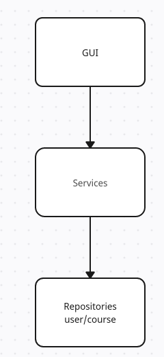

Ohjelman rakenne

GUI sisältää graafisen käyttöliittymän, joka kutsuu vain services-moduulin oliota sisu_services.

Services-moduuli sisältää olion sisu_services, joka sisältää mm. tiedon sisäänkirjautuneet käyttäjän idstä sekä tutkinnon idstä. Tämän lisäksi services toimii käyttöliittymän ja repositorioiden välikätenä, eli tämä moduuli kutsuu UserRepository ja CourseRepositroy -olioita.

Repositories sisältää kaksi luokkaa UserRepository ja CourseRepository. Nämä luokat hoitavat tietokantaoperaatiot, UserRepository tauluun users liittyvät ja CourseRespository tauluihin courses ja participants liittyvät operaatiot. Näiden kahden luokan välillä ei ole suoraa yhteyttä, eli esimerkiksi silloin kun CourseRepository tarvitsee tietoa käyttäjän tutkinto-ohjelman idstä, se tieto saadaan services-luokan kautta

Kaavio, kun käyttäjä luodaan onnistuneesti
