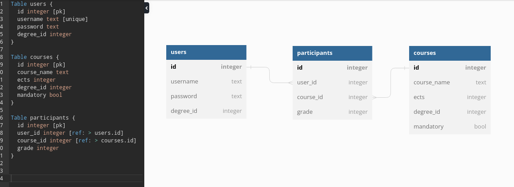
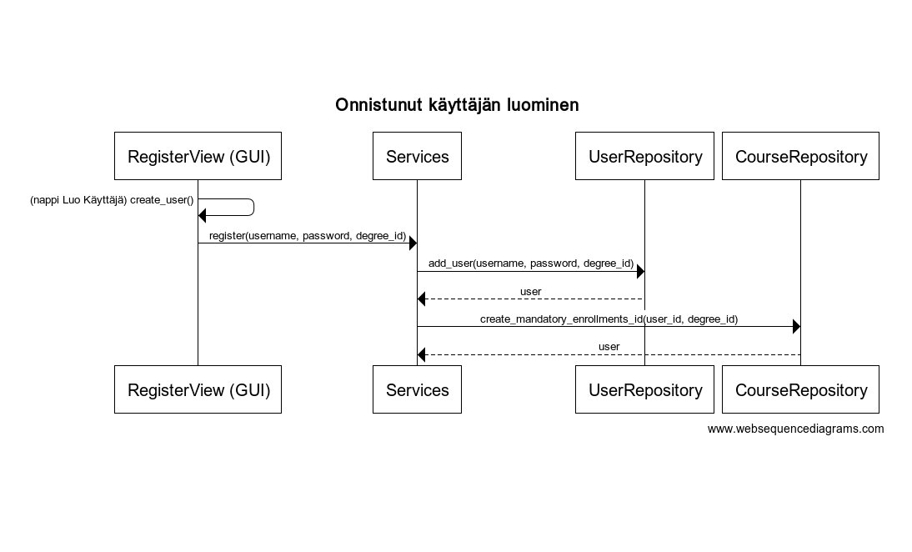

# Ohjelman rakenne

GUI sisältää graafisen käyttöliittymän, joka kutsuu vain services-moduulin oliota sisu_services.

Services-moduuli sisältää olion sisu_services, joka sisältää mm. tiedon sisäänkirjautuneet käyttäjän idstä sekä tutkinnon idstä. Tämän lisäksi services toimii käyttöliittymän ja repositorioiden välikätenä, eli tämä moduuli kutsuu UserRepository ja CourseRepositroy -olioita.

Repositories sisältää kaksi luokkaa UserRepository ja CourseRepository. Nämä luokat hoitavat tietokantaoperaatiot, UserRepository tauluun users liittyvät ja CourseRespository tauluihin courses ja participants liittyvät operaatiot. Näiden kahden luokan välillä ei ole suoraa yhteyttä, eli esimerkiksi silloin kun CourseRepository tarvitsee tietoa käyttäjän tutkinto-ohjelman idstä, se tieto saadaan services-luokan kautta

Kaavio, kun käyttäjä luodaan onnistuneesti

## Tietokanta
Ohjelman tietokanta on toteutettu SQLitellä, ja sisältää kolme taulua. Selitän vain epäilmeiset osat:
- taulussa users degree_id kertoo, mitä tutkintoa opiskelija suorittaa. Tämä on tärkeää myöhemmin.
- taulussa courses mandatory kertoo, onko kurssi pakollinen. Tätä tietoa tarvitaan myöskin myöhemmin
- taulu participants sisältää tiedot opiskelijoiden kurssisuorituksista. Arvosanat ovat normaali 0-5, ja -1 on vakioarvo, joka tarkoittaa suorittamatonta kurssia (ei oteta huomioon keskiarvoa laskettaessa)

## Moduulit
UserRepository tällä hetkellä käsittelee "backend" toiminnot users-taulun kanssa. Käyttäjän luominen, sisäänkirjautuminen yms. hoidetaan täällä

CourseRepository on laajempi, sillä se hoitaa taulujen courses ja participants operaatiot, eli kurssien luomiset ja lisäämiset opintosuunnitelmaan, arvosanan päivttäminen yms.

Services on näiden kahden luokan ja GUIn välissä. GUI kutsuu Service-luokan oliota sisu_service, joka itse kutsuu repository-luokkia. sisu_service sisältää näiden toimintojen lisäksi tiedon kirjautuneen käyttäjän idstä ja 

initialize_database hoitaa tietokantojen luonnin. Sen lisäksi, että tässä luodaan tietokantataulut, täällä myös luodaan pakolliset kurssit eri koulutusohjelmiin, sillä jos kaikki käyttäjät joutusivat lisäämään omat pakolliset kurssinsa, se olisi tyhmää. Täällä on siis määritelty tutkintojen (tällä hetkellä vain tkt) pakolliset kurssit, jotka lisätään tietokantaan heti taulujen luomisen jälkeen. Näillä kursseilla courses-taulun mandatory on true, millään muilla ei. Kun käyttäjä rekisteröityy, haetaan taulusta courses niiden kurssien id, joissa mandatory on true, ja degree_id on rekisteröityneen ja luodaan tauluun participants user_id, course_id pareja (ja arvosana tietysti).

database_connection hoitaa yhteyden tietokantaan. Ei ihan sillä tavalla kuin materiaalissa neuvotaan, mutta toimi virtuaalikoneella niin kelpaa minulle. Moduuli sisältää myös yhteyden muodostamisen testitietokantaan, jota kutsutaan testien setUp()issa

GUI tietysti hoitaa käyttöliittymän Tkinterillä, ja kutsuu repositories-luokkia services-luokan kautta välillisesti
