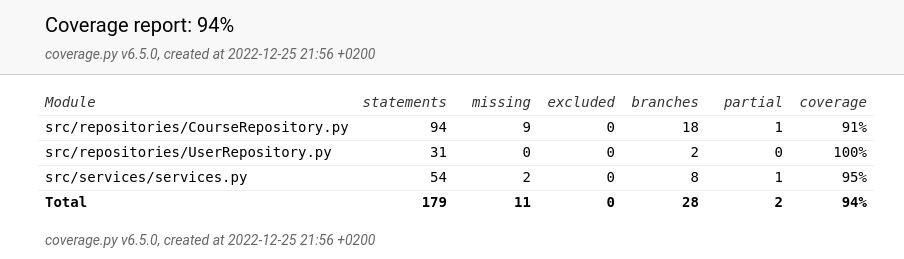

# Testidokumentti
Ohjelmaa on testattu yksikkötestein ja manuaalisesti niin paikallisesti kuin yliopiston virtuaalikoneella.

## Yksikkötestit
Testikattavuus

Testikattavuus ei sisällä tietokannan alustustoimenpiteiden moduuleita, eli moduuleita database_connection tai initialize_database, eikä graafisen käyttöliittymää.

Yksikkötesteissä käytetään kovakoodattua testitietokantaa. Ohjelman rakenne muuttui paljon palautuspäivänä, joten repository ja services testeissä on paljon päällekkäisyyksiä.

Repositories-testit olivat ensin, joiden alussa tietokantayhteys vaihdetaan testitietokantaan database_connection.pystä. 

Services siis sisältää paljon päällekäisyyksiä edellisten kanssa, koska se kutsuu repositories-luokkien funktioita, mutta testikattavuus kuitenkin nousi ihan kivalle tasolle

# Järjestelmätestaus
Graafista käyttöliittymää testattiin laitoksen virtuaalikoneella ja kaikki toimi hyvin. Testien ajamisessa database is locked -virhe tuli toisinaan, mutta ajamalla ohjelman /tmp ratkaisi ongelman. Ohjelmaa on testattu vain Linuxilla.